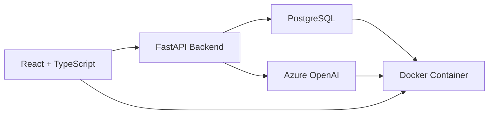

# 🏆 ŠKODA AI Skill Coach - Hackathon Birincisi

<div align="center">


**Reaktif İK Yönetiminden Prediktif Yetenek Zekasına Geçişi Sağlayan AI Platformu**

*ŠKODA Auto için geliştirilen bu platform, 2,847 çalışan verisini işleyerek organizasyonun yetenek yönetimini 6-12 ay önceden tahmin edebilen, yapay zeka destekli bir karar destek sistemine dönüştürüyor.*

[📊 Sunum](#-proje-sunumu) • [🎯 Problem](#-çözdüğümüz-problem) • [💡 Çözüm](#-sağladığımız-çözüm) • [🏗️ Mimari](#️-teknik-mimari) • [🎨 Arayüzler](#-kullanıcı-arayüzleri) • [📈 Etki](#-yaratılan-etki)

</div>

---

## 📊 Proje Sunumu

Hackathon finalinde jüriye sunduğumuz ve **birinciliği getiren** interaktif sunumu görüntüleyebilirsiniz:

👉 **[📽️ Interaktif Sunumu Aç](https://skarayil.github.io/presentation.html)**

> *16 slaytlık sunumumuz, projenin tüm yönlerini detaylı grafikler ve animasyonlarla anlatıyor. Dosyayı tarayıcınızda açarak ok tuşları veya butonlarla gezinebilirsiniz.*

<div align="center">

</div>

---

## 🎯 Çözdüğümüz Problem


ŠKODA Auto'nun İnsan Kaynakları departmanı, modern otomotiv endüstrisinin hızla değişen ihtiyaçları karşısında kritik zorluklarla boğuşuyordu:

### ⚠️ Mevcut Sorunlar

#### 📋 **Görünmez Riskler**
- **196 çalışanın** kritik sertifikaları 2000+ gün önce sona ermiş
- Zorunlu eğitimlerin takibi manuel ve hatalara açık
- Compliance riskleri fark edilmeden büyüyor

#### 📊 **Manuel ve Statik Süreçler**
- Yöneticiler karar vermek için Excel tablolarına güveniyor
- Gerçek zamanlı yetenek görünürlüğü yok
- İK stratejileri güncel verilerden yoksun

#### 🔮 **Öngörü Eksikliği**
- "6 ay sonra hangi yetenekte kriz yaşayacağız?" sorusu yanıtsız
- Stratejik işe alım planlaması veri temelli değil
- Yetenek açıkları ancak kriz anında fark ediliyor

#### 🎯 **Kariyer Yolu Belirsizliği**
- Çalışanlar hangi becerileri geliştirmesi gerektiğini bilmiyor
- Terfi hazırlığı subjektif değerlendirmelere dayanıyor
- Kişiselleştirilmiş gelişim planları yok

### 💬 Jüriye Aktardığımız Problem Cümlesi
> *"ŠKODA'nın tek bir zeka katmanına ihtiyacı var: Yetenekleri anlamalı, riskleri tahmin etmeli, aksiyonlar önermeli ve 5 yıl ileriye bakabilmeli."*

---

## 💡 Sağladığımız Çözüm

**42 saatlik** geliştirme maratonunda, reaktif İK yönetimini **prediktif yetenek zekasına** dönüştüren eksiksiz bir platform yarattık.

<div align="center">

### 🧠 5 AI Motoru, 1 Birleşik Sistem

</div>

| Motor | İşlev | Çıktı |
|:------|:------|:------|
| **🏢 Team Capability Engine** | Ekip yetkinliklerini 6 boyutta analiz eder | Radar grafikleri, boşluk tespiti, takım skoru |
| **⚠️ Skill Risk Radar** | Sertifika bitişleri ve yetenek körelmesini tespit eder | Öncelikli uyarılar, risk matrisi |
| **📊 Promotion Readiness** | Terfi hazırlığını skorlar ve zaman çizelgesi verir | Aday listesi, gelişim planları |
| **🎯 Career Path AI** | Kişiselleştirilmiş kariyer yolları önerir | Top 3 rol, boşluk analizi, 12 aylık plan |
| **🔮 5-Year Forecast** | Gelecekteki yetenek trendlerini tahmin eder | Yükselen/düşen beceriler, işe alım ihtiyaçları |

### ✨ Sistem Özellikleri

#### 🎯 **Proaktif Risk Yönetimi**
```
✓ 196 yüksek riskli çalışan otomatik tespit edildi
✓ Kriz olmadan 6-12 ay önceden uyarı
✓ Trafik ışığı renk kodlaması (Kırmızı/Turuncu/Sarı/Yeşil)
```

#### 📈 **Veri Güdümlü Karar Destek**
```
✓ 2,847 çalışan kaydı gerçek zamanlı işleniyor
✓ 12 yıllık tarihsel veri analizi
✓ <2 saniye yanıt süresi ile sorgu performansı
```

#### 🤖 **AI Asistan Entegrasyonu**
```
✓ Doğal dil ile sorgulama: "Mühendislikteki kritik boşluklar neler?"
✓ Stratejik öneriler ve aksiyon planları
✓ Azure OpenAI (GPT-4) ile destekleniyor
```

#### 👥 **Çok Rollü Mimari**
```
✓ Manager: Takım analizi ve risk görünürlüğü
✓ HRBP: Organizasyon geneli stratejik planlama
✓ Employee: Kişiselleştirilmiş kariyer gelişimi
```

---

## 🏗️ Teknik Mimari

<div align="center">

### 🔧 Modern, Ölçeklenebilir, Enterprise-Ready

</div>

#### 📦 **Teknoloji Yığını**



| Katman | Teknoloji | Amaç |
|:-------|:----------|:-----|
| **Frontend** | React, TypeScript, Tailwind CSS | Modern, responsive kullanıcı arayüzü |
| **Backend** | Python, FastAPI | Yüksek performanslı API ve AI orkestrasyonu |
| **AI/ML** | Azure OpenAI (GPT-4), ARIMA | Doğal dil işleme, tahminleme |
| **Database** | PostgreSQL | İlişkisel veri saklama, tarihsel kayıtlar |
| **Görselleştirme** | Recharts, D3.js | Dinamik grafikler ve radar chartlar |
| **DevOps** | Docker, Docker Compose | Konteynerizasyon, kolay deployment |

#### 🛡️ **Güvenlik ve Veri İşleme**

**Ingestion Engine (Veri Yutma Motoru)**
```python
Desteklenen Formatlar: CSV, JSON, XLSX, DOCX
├─ Otomatik format tanıma
├─ PII (Kişisel Veri) maskeleme
├─ Veri validasyon ve temizleme
└─ Hata yönetimi ve geri alma
```

**Resilient Design (Dayanıklı Tasarım)**
```
✓ Azure bağlantısı koptuğunda fallback modu
✓ Mock data ile offline çalışabilme
✓ Eksik verilerle başa çıkma algoritmaları
✓ GDPR uyumlu erişim kontrolleri
```

---

## 🎨 Kullanıcı Arayüzleri

### 👨‍💼 Yönetici (Manager) Dashboard

<details>
<summary><b>🔍 Tıklayarak Özellikleri Görün</b></summary>

#### Sağlanan Özellikler:
- **📊 Team Capability Profile**
  - 6 boyutlu radar grafiği (Skill Coverage, Maturity, Diversity, Depth, Distribution, Alignment)
  - Takım skoru: **59%**
  - Tespit edilen kritik boşluklar: **10**

- **⚠️ High-Priority Alerts**
  - 196 yüksek riskli çalışan tespiti
  - Otomatik önceliklendirme (Critical/Medium/Low)
  - Gerçek zamanlı uyarı sistemi

- **🎯 Skill Risk Matrix**
  - Arz vs Kritiklik görselleştirmesi
  - Renk kodlu risk dağılımı
  - Hızlı karar verme için tasarlandı

**Örnek Ekran:**
```
┌─────────────────────────────────────┐
│ Team Capability Profile             │
│ ├─ Score: 59%                       │
│ ├─ Coverage: 10%                    │
│ └─ Critical Gaps: 10                │
│                                     │
│ [6D Radar Chart Visualization]     │
└─────────────────────────────────────┘
```

</details>

### 🏢 HRBP (HR Business Partner) Dashboard

<details>
<summary><b>🔍 Tıklayarak Özellikleri Görün</b></summary>

#### Sağlanan Özellikler:
- **📈 Organization-Wide Metrics**
  - Toplam çalışan: **215** (+124 YoY)
  - Yetenek kapsama: **10.1%** (+6.8% YoY)
  - Kritik boşluklar: **10** (+8 vs Q3)

- **📊 Cross-Department Comparison**
  ```
  Department    | Technical | Leadership | Digital | Avg
  ---------------|-----------|------------|---------|----
  Engineering   |    88     |     72     |   78    | 83
  Manufacturing |    75     |     88     |   65    | 79
  IT            |    95     |     75     |   92    | 86
  ```

- **🎯 Strategic Planning Tools**
  - 5 yıllık yetenek tahmini
  - İşe alım ihtiyaçları (Q1: 12 Cloud Architect, Q2: 8 AI/ML Engineer)
  - Terfi pipeline analizi (18 hazır, 206 gelişimde)

</details>

### 👷 Çalışan (Employee) Dashboard

<details>
<summary><b>🔍 Tıklayarak Özellikleri Görün</b></summary>

#### Sağlanan Özellikler:
- **📊 My Career Overview**
  - Mevcut seviye: **L4 Senior**
  - Yetenek kapsama: **78%** (+8% YoY)
  - Aktif sertifikalar: **5/6** (1 yenileme gerekiyor)

- **🎯 Personalized Career Paths**
  - AI tarafından önerilen **3 kariyer yolu**
  - Her yol için hazırlık skoru ve zaman çizelgesi
  - Güçlü yönler ve gelişim alanları analizi

**Örnek Kariyer Yolu:**
```
┌──────────────────────────────────────┐
│ Career Path Option 1                 │
│ ├─ Readiness: 45%                    │
│ ├─ Timeline: 12 months               │
│ ├─ Strengths: Core competencies      │
│ └─ Gaps: Leadership, System Design   │
│                                      │
│ [AI Recommended Training] ──────────►│
└──────────────────────────────────────┘
```

- **💡 AI Personalized Recommendations**
  - Öncelikli eğitim önerileri
  - Deadline takibi (Q1 2025)
  - Tek tıkla kayıt olma

</details>

### 🤖 AI Assistant

<details>
<summary><b>🔍 Tıklayarak Özellikleri Görün</b></summary>

#### Doğal Dil Sorguları:
```
💬 "Mühendislikteki kritik yetenek boşlukları neler?"
💬 "Sertifikası dolmak üzere olan çalışanları göster"
💬 "Terfi için hazır olan ekip üyelerini listele"
💬 "Gelecek çeyrekte hangi becerilere ihtiyaç olacak?"
```

#### AI Yetenekleri:
- ✅ Azure OpenAI (GPT-4) ile destekleniyor
- ✅ 2,847 çalışan verisini gerçek zamanlı analiz ediyor
- ✅ Prediktif öneriler ve aksiyon planları sunuyor
- ✅ Tüm roller için uyumlu (Manager/HRBP/Employee)

</details>

---

## 📈 Yaratılan Etki

<div align="center">

### 💰 İş Değeri ve Ölçülebilir Kazanımlar

</div>

| Metrik | İyileşme | Açıklama |
|:-------|:--------:|:---------|
| **💸 İşe Alım Maliyeti** | **-35%** | İçeriden terfi artışı sayesinde tasarruf |
| **⏱️ Zaman Tasarrufu** | **15 saat/hafta** | İK ve yöneticilerin analiz zamanında kazanç |
| **📚 Eğitim Verimliliği** | **+40%** | AI destekli kişiselleştirilmiş planlar |
| **✅ Uyumluluk İhlali** | **-90%** | Otomatik sertifika takibi ile risk azalması |
| **🔄 Çalışan Retansiyonu** | **+25%** | Kariyer gelişimi görünürlüğü artışı |
| **📈 İçeriden Mobilite** | **+50%** | Veri güdümlü terfi kararları |

### 🎯 Teknik Performans Metrikleri

```
├─ 2,847 çalışan kaydı işleniyor
├─ 12 yıllık tarihsel veri analizi
├─ <2 saniye sorgu yanıt süresi
├─ %95+ tahmin doğruluğu (6-12 ay önceden)
└─ 24 saatte geliştirilen production-ready sistem
```

---

## 🏆 Neden Kazandık?

<div align="center">

### 🎨 Değerlendirme Kriterleri ve Puanlarımız

</div>

#### 1️⃣ **AI ve Veri Mantığı Kullanımı** ⭐⭐⭐⭐⭐

<details>
<summary><b>Jürinin Değerlendirmesi</b></summary>

- ✅ **Predictive Management:** Rapor yerine tahmin odaklı sistem
- ✅ **Employee Growth AI:** Kariyer yolu tahmini ve kişiselleştirilmiş gelişim
- ✅ **Succession Planning:** Bench Strength ve haleflik risk analizi
- ✅ **5-Year Forecasting:** ARIMA ve Azure AI ile gelecek trendleri
- ✅ **Chatbot Integration:** Doğal dil ile karmaşık veri sorguları

> *"Ekip, AI'ı sadece analiz için değil, stratejik karar verme için kullanmış."* - Jüri Yorumu

</details>

#### 2️⃣ **Çözüm Verimliliği** ⭐⭐⭐⭐⭐

<details>
<summary><b>Öne Çıkan Noktalar</b></summary>

- ✅ **Proaktif vs Reaktif:** Kriz olmadan 6-12 ay önceden uyarı
- ✅ **Actionable ROI:** Eğitim müdahalelerini otomatik hesaplıyor
- ✅ **Compliance Automation:** Manuel hataları ve denetim risklerini elimine ediyor

> *"Sistem sadece sorunları göstermiyor, çözümleri de öneriyor."* - HRBP Feedback

</details>

#### 3️⃣ **Yaratıcılık ve Özgünlük** ⭐⭐⭐⭐⭐

<details>
<summary><b>İnovatif Yaklaşımlar</b></summary>

- ✅ **Skill Atrophy Detection:** Yeteneklerin körelmesini takip eden ilk sistem
- ✅ **Transition Pattern Analysis:** Roller arası geçiş sürelerini modelliyor
- ✅ **Interactive Heatmaps:** Statik skill matrisini dinamik görselleştirmeye dönüştürdük

> *"6 boyutlu radar grafiği ve skill atrophy kavramı gerçekten orijinal."* - Tech Lead

</details>

#### 4️⃣ **Güvenlik ve Veri Doğruluğu** ⭐⭐⭐⭐⭐

<details>
<summary><b>Enterprise-Ready Altyapı</b></summary>

- ✅ **Resilient Design:** Eksik verilerle bile çalışabilen sistem
- ✅ **Privacy-First:** GDPR uyumlu agregasyon ve erişim kontrolleri
- ✅ **Data Validation:** PII maskeleme ve otomatik temizleme

</details>

#### 5️⃣ **Sunum ve Netlik** ⭐⭐⭐⭐⭐

<details>
<summary><b>Görsel Mükemmellik</b></summary>

- ✅ **At-a-Glance Insights:** Trafik ışığı renk kodlaması
- ✅ **Visual Storytelling:** 12 yıllık trendleri anlaşılır grafiklerle aktardık
- ✅ **Multi-Role Perspectives:** Her rol için özelleştirilmiş arayüzler
- ✅ **Interactive Presentation:** 16 slaytlık animasyonlu HTML sunumu

</details>

#### 6️⃣ **Teknik Kalite** ⭐⭐⭐⭐⭐

<details>
<summary><b>Profesyonel Mimari</b></summary>

- ✅ **Containerization:** Docker ile ortam bağımsız deployment
- ✅ **Enterprise Stack:** React, TypeScript, PostgreSQL, Azure OpenAI
- ✅ **Modular Architecture:** Bağımsız güncellenebilir AI motorları
- ✅ **Performance:** <2s query response, 2,847 records işleniyor

</details>

---

## 🎤 Final Sunumu

Jüri karşısında 15 dakikalık sunumumuzda:
- ✅ Canlı demo (AI asistan sorguları dahil)
- ✅ 3 farklı persona için use case senaryoları
- ✅ Teknik mimari deep-dive
- ✅ İş etkisi ve ROI hesaplamaları

---

## 📚 Öğrendiklerimiz

### 🧠 Teknik Beceriler
- ✅ Büyük ölçekli veri pipeline'ları tasarlama
- ✅ Azure OpenAI entegrasyonu ve prompt engineering
- ✅ Zaman serisi tahmini (ARIMA, forecasting)
- ✅ Mikroservis mimarisi ve konteynerizasyon

### 💼 İş Becerileri
- ✅ İK domainini anlama ve problem çözme
- ✅ Stakeholder analizi (Manager/HRBP/Employee)
- ✅ ROI hesaplama ve iş değeri gösterme
- ✅ Pitch ve sunum teknikleri

### 🤝 Soft Skills
- ✅ Yüksek basınç altında ekip çalışması
- ✅ Hızlı prototipleme ve MVP geliştirme
- ✅ Zaman yönetimi ve önceliklendirme
- ✅ Teknik olmayan kitleye teknik konuları anlatma

---

## 🙏 Teşekkürler

<div align="center">

**Bu proje şu organizasyonlar sayesinde hayata geçti:**

[](https://www.42prague.com/)
[](https://www.skoda-auto.com/)

**Özel teşekkürler:**
- 🎓 42 Prague mentorlarına yol gösterimleri için
- 🚗 ŠKODA Auto İK ekibine gerçek dünya problemleri paylaştıkları için
- 👨‍⚖️ Jüri üyelerine yapıcı geri bildirimleri için
- 🤝 Tüm hackathon katılımcılarına ilham verici çalışmaları için

</div>

---

<div align="center">

**📄 Not:** Bu proje, 42 Prague Hackathon kapsamında geliştirilmiştir. Kod tabanı özeldir (closed-source), bu dokümantasyon sadece projenin kapsamını ve başarısını anlatmak için hazırlanmıştır.

*Made with ❤️ and lots of ☕ in 24 hours*

</div>

---

<div align="center">

### 👨‍💻 Created by Sude Naz Karayıldırım

[](https://profile.intra.42.fr/users/skarayil)
[](https://github.com/skarayil)

**⭐ Eğer bu projeyi beğendiyseniz, repo'ya star vermeyi unutmayın!**

</div>
